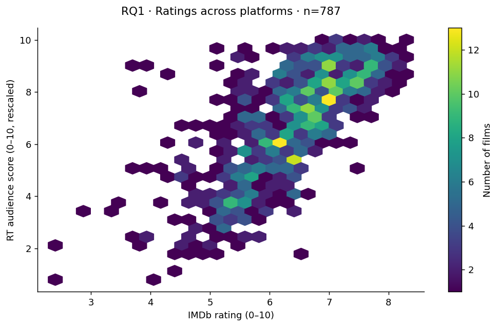
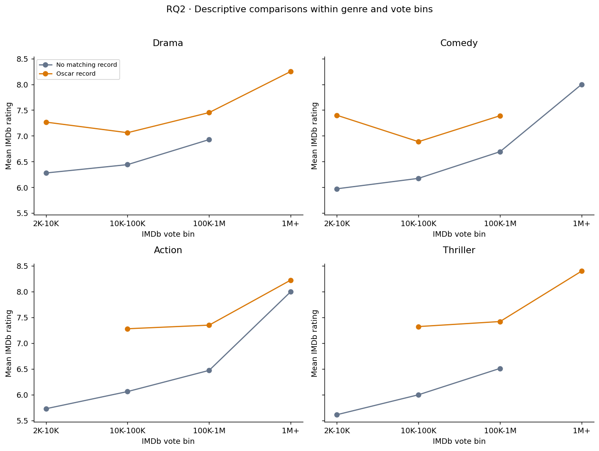

# Movie Ratings Across IMDb, Rotten Tomatoes & the Oscars

A database-driven study of audience ratings, popularity, critic scores, and Oscar recognition for movies released in **2016–2025**. Originally a **CPSC 368 Group 1 course project**, implemented with Oracle SQL and MongoDB aggregation pipelines; reorganized here as a reproducible portfolio repository.

[中文说明](README.zh-CN.md) · [Project walkthrough](docs/PROJECT_WALKTHROUGH.zh-CN.md) · [Database design](docs/ARCHITECTURE.md) · [Original report](reports/original/final-report.pdf)



## What this project demonstrates

- Integration of three data sources using IMDb IDs and title/year reconciliation.
- Relational modeling with primary keys, foreign keys, joins, and Oracle SQL.
- MongoDB embedded documents, aggregation, array unwinding, and grouped comparisons.
- A four-stage matching workflow: exact match → year tolerance → title simplification → fuzzy match.
- Reproducible descriptive analysis, visualizations, data checks, and documented limitations.

## Research questions and reproduced results

| Question | Result from the supplied snapshots |
| --- | --- |
| How do IMDb ratings relate to RT audience scores? | Positive association: Pearson **r = 0.7172**, 787 exact-matched films. |
| How do ratings differ by Oscar recognition, popularity, and genre? | 348 films have a matching Oscar record; their overall mean IMDb rating is **7.319**, versus **6.132** for 9,799 films without one. Genre/vote-bin comparisons are descriptive. |
| How does IMDb popularity relate to RT critic scores? | Weak raw-vote association: Pearson **r = 0.1425**, 787 films. For log10(votes), **r = 0.0766**. |

The supplied inputs contain **10,147 IMDb films**, **494 Oscar film records**, and **1,107 RT rows**. Matching improves from **787 to 802 RT rows** over four rounds; the main analysis intentionally retains the **787-row exact-match baseline** used by the original databases. The extra matches remain a separate reconciliation experiment.

These are associations, not causal effects or significance tests. “Oscar record” includes recognition in the supplied file, not verified winner status. Oscar coverage ends in **2024**, so missing records—especially for 2025 films—do not establish absence of recognition. RT percentages were already divided by 10; rescaling does not make their meaning identical to IMDb ratings. See [data provenance and limitations](docs/DATA.md).

## Run locally

Use **Python 3.11**. From this repository directory:

```sh
python -m venv .venv
# Windows PowerShell:
.venv\Scripts\Activate.ps1
# macOS / Linux: source .venv/bin/activate
python -m pip install -r requirements.txt
python scripts/reproduce.py
python scripts/run_matching.py
python -m unittest discover -s tests -v
```

If PowerShell activation is restricted, call `.venv\Scripts\python.exe` directly in place of `python`.

The default analysis executes the original three SELECT queries in an **in-memory SQLite database** and needs no database server or credentials. It writes seven figures, query tables, grouped summaries, a metrics JSON, and MongoDB-ready JSONL. The local runner is a portfolio addition; Oracle and MongoDB were the original implementations.

```sh
python scripts/reproduce.py --data-dir data/input --output reports
```

**Optional databases:** install `requirements-databases.txt`, then follow [database setup](docs/DATABASE_SETUP.md) for Oracle and MongoDB. Their live-server execution has not been reverified during this reorganization.

## Repository layout

```text
data/
  input/                 One canonical copy of the three cleaned snapshots
  reference/             Original final matching results for regression checks
  processed/             Generated matching rounds (Git-ignored)
src/movie_analysis/      Data validation, local analysis, MongoDB pipelines
scripts/                 Reproduction, matching, optional database entry points
sql/                     Oracle schema and original research SELECT queries
reports/
  figures/               Regenerated figures used in this README
  results/               Reproduced metrics; large derived outputs Git-ignored
  original/              Original final report, slides, and phase reports
docs/                    Walkthrough, data dictionary, setup, publication guide
archive/                 Sanitized historical notebooks, scripts, and draft
tests/                   Data and reproduction regression tests
.github/workflows/       Reproduction checks on pushes and pull requests
```



## Provenance and scope

The original full raw datasets and earliest cleaning scripts were not present in the recovered folder. Reproduction therefore starts from the saved cleaned CSV files. The reports describe earlier cleaning, but this repository does not claim to regenerate those snapshots from raw downloads.

Historical reports are preserved unchanged; current documentation corrects overstatements and distinguishes new reproducibility work from original coursework. See [changes](docs/REORGANIZATION.md) and [credits and usage notes](NOTICE.md). This is a group project; individual contributions are not established by the surviving files.

To publish this directory, follow the [GitHub guide](docs/GITHUB.zh-CN.md).
