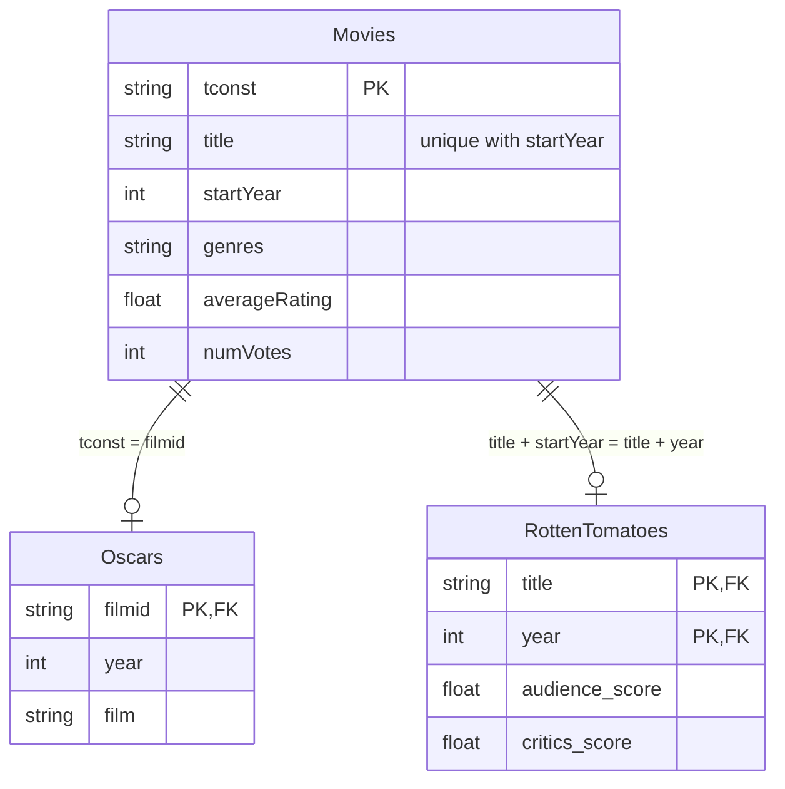
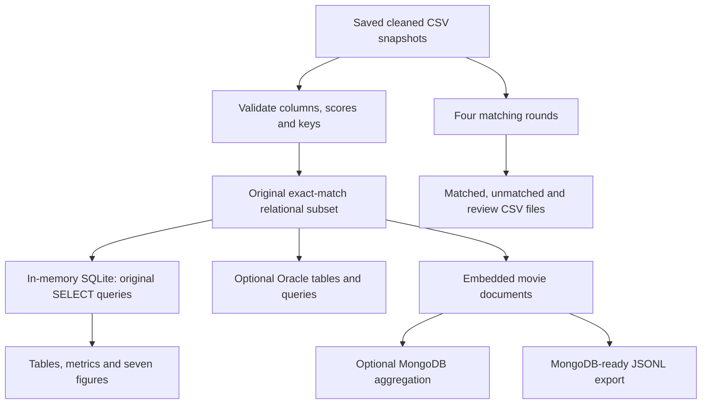

# Database and workflow design

## Original relational model



The film-level Oscar snapshot has one record per IMDb ID, so this is an optional one-to-one relation, not a complete award-event model. RT references the composite unique title/year key. The executable Oracle DDL is in [`sql/oracle_schema.sql`](../sql/oracle_schema.sql); it contains no DROP or PURGE commands.

## MongoDB model

One document per IMDb movie, with a genre array, nested IMDb attributes, optional RT attributes, and a boolean Oscar-membership flag. The following illustrates the generated structure for a record in the supplied snapshots:

```json
{
  "_id": "tt1431045",
  "tconst": "tt1431045",
  "title": "deadpool",
  "year": 2016,
  "genres": ["Action", "Comedy", "Sci-Fi"],
  "imdb": {"rating": 8.0, "votes": 1245214},
  "oscar": false,
  "rotten": {
    "title": "deadpool",
    "year": 2016,
    "ratings": {"audience": 9.0, "critics": 8.5}
  }
}
```

The exact generated record, including genre membership, should be read from `reports/results/merged_movies.jsonl`. `_id = tconst` is a new reproducibility choice; original MongoDB insertion used generated IDs. In the original implementation, `$lookup` joined three staging collections and `$out` materialized `merged_movies`. The new optional loader constructs the merged documents directly from CSV while retaining the original analysis fields and aggregation pipelines.

## Reproduction workflow



SQLite is a newly added local execution path for the SELECT queries, not a claim that Oracle DDL, constraints, data types, and runtime behavior are identical. The loader validates the relevant source keys before local querying. Live Oracle/MongoDB behavior requires separate server validation.
